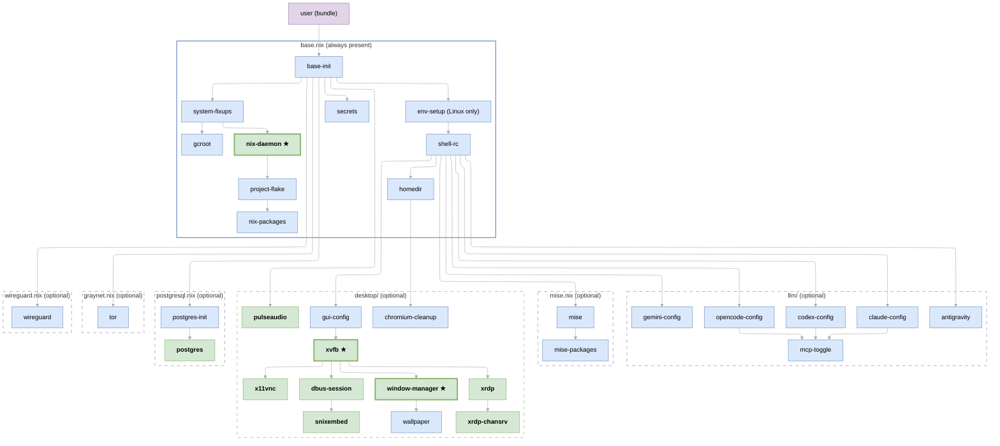

```mermaid
%%{init: {"flowchart": {"defaultRenderer": "elk"}, "themeVariables": {"lineColor": "#aaa"}}}%%
graph TD
    classDef oneshot fill:#dae8fc,stroke:#6c8ebf,color:#000
    classDef longrun fill:#d5e8d4,stroke:#82b366,color:#000,font-weight:bold
    classDef readiness fill:#d5e8d4,stroke:#82b366,color:#000,font-weight:bold,stroke-width:3px
    classDef bundle fill:#e1d5e7,stroke:#9673a6,color:#000

    user["user (bundle)"]:::bundle
    base_init["base-init"]:::oneshot

    user --> base_init

    subgraph base ["base.nix (always present)"]
        base_init
        system_fixups["system-fixups"]:::oneshot
        shell_rc["shell-rc"]:::oneshot
        homedir["homedir"]:::oneshot
        nix_daemon["nix-daemon ★"]:::readiness
        gcroot["gcroot"]:::oneshot
        project_flake["project-flake"]:::oneshot
        nix_packages["nix-packages"]:::oneshot
        secrets["secrets"]:::oneshot
        env_setup["env-setup (Linux only)"]:::oneshot
    end

    base_init --> system_fixups
    base_init --> secrets
    base_init --> env_setup
    env_setup --> shell_rc
    system_fixups --> gcroot
    system_fixups --> nix_daemon
    shell_rc --> homedir
    nix_daemon --> project_flake
    project_flake --> nix_packages

    subgraph llm ["llm/ (optional)"]
        claude_config["claude-config"]:::oneshot
        codex_config["codex-config"]:::oneshot
        opencode_config["opencode-config"]:::oneshot
        gemini_config["gemini-config"]:::oneshot
        mcp_toggle["mcp-toggle"]:::oneshot
        antigravity["antigravity"]:::oneshot
    end

    shell_rc --> claude_config
    shell_rc --> codex_config
    shell_rc --> opencode_config
    shell_rc --> gemini_config
    shell_rc --> antigravity
    claude_config --> mcp_toggle
    codex_config --> mcp_toggle
    opencode_config --> mcp_toggle

    subgraph mise_mod ["mise.nix (optional)"]
        mise["mise"]:::oneshot
        mise_packages["mise-packages"]:::oneshot
    end

    shell_rc --> mise
    mise --> mise_packages

    subgraph desktop ["desktop/ (optional)"]
        gui_config["gui-config"]:::oneshot
        xvfb["xvfb ★"]:::readiness
        window_manager["window-manager ★"]:::readiness
        wallpaper["wallpaper"]:::oneshot
        x11vnc["x11vnc"]:::longrun
        xrdp["xrdp"]:::longrun
        xrdp_chansrv["xrdp-chansrv"]:::longrun
        dbus_session["dbus-session"]:::longrun
        snixembed["snixembed"]:::longrun
        pulseaudio["pulseaudio"]:::longrun
        chromium_cleanup["chromium-cleanup"]:::oneshot
    end

    shell_rc --> gui_config
    base_init --> pulseaudio
    homedir --> chromium_cleanup
    gui_config --> xvfb
    xvfb --> window_manager
    xvfb --> x11vnc
    xvfb --> xrdp
    xvfb --> dbus_session
    xrdp --> xrdp_chansrv
    dbus_session --> snixembed
    window_manager --> wallpaper

    subgraph pg ["postgresql.nix (optional)"]
        postgres_init["postgres-init"]:::oneshot
        postgres["postgres"]:::longrun
    end

    base_init --> postgres_init
    postgres_init --> postgres

    subgraph graynet_mod ["graynet.nix (optional)"]
        tor["tor"]:::oneshot
    end

    base_init --> tor

    subgraph wg_mod ["wireguard.nix (optional)"]
        wireguard["wireguard"]:::oneshot
    end

    base_init --> wireguard

    style base fill:none,stroke:#6c8ebf,stroke-width:2px
    style llm fill:none,stroke:#9673a6,stroke-dasharray:8 8
    style mise_mod fill:none,stroke:#9673a6,stroke-dasharray:8 8
    style desktop fill:none,stroke:#82b366,stroke-dasharray:8 8
    style pg fill:none,stroke:#9673a6,stroke-dasharray:8 8
    style graynet_mod fill:none,stroke:#9673a6,stroke-dasharray:8 8
    style wg_mod fill:none,stroke:#9673a6,stroke-dasharray:8 8
```
