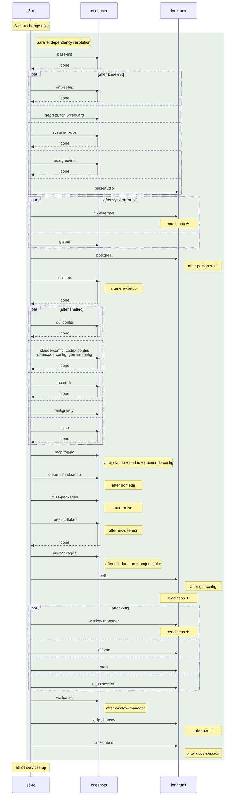

```mermaid
sequenceDiagram
    participant RC as s6-rc
    participant O as oneshots
    participant L as longruns

    Note over RC: s6-rc -u change user

    rect rgba(100, 160, 100, 0.15)
        Note right of RC: parallel dependency resolution

        RC->>O: base-init
        activate O
        O-->>RC: done
        deactivate O

        par after base-init
            RC->>O: env-setup
            activate O
            O-->>RC: done
            deactivate O
        and
            RC->>O: secrets, tor, wireguard
        and
            RC->>O: system-fixups
            activate O
            O-->>RC: done
            deactivate O
        and
            RC->>O: postgres-init
            activate O
            O-->>RC: done
            deactivate O
        and
            RC->>L: pulseaudio
            activate L
        end

        par after system-fixups
            RC->>L: nix-daemon
            activate L
            Note over L: readiness ★
        and
            RC->>O: gcroot
        end

        RC->>L: postgres
        activate L
        Note right of L: after postgres-init

        RC->>O: shell-rc
        activate O
        Note right of O: after env-setup
        O-->>RC: done
        deactivate O

        par after shell-rc
            RC->>O: gui-config
            activate O
            O-->>RC: done
            deactivate O
        and
            RC->>O: claude-config, codex-config,<br/>opencode-config, gemini-config
            activate O
            O-->>RC: done
            deactivate O
        and
            RC->>O: homedir
            activate O
            O-->>RC: done
            deactivate O
        and
            RC->>O: antigravity
        and
            RC->>O: mise
            activate O
            O-->>RC: done
            deactivate O
        end

        RC->>O: mcp-toggle
        Note right of O: after claude + codex + opencode config

        RC->>O: chromium-cleanup
        Note right of O: after homedir

        RC->>O: mise-packages
        Note right of O: after mise

        RC->>O: project-flake
        activate O
        Note right of O: after nix-daemon
        O-->>RC: done
        deactivate O

        RC->>O: nix-packages
        Note right of O: after nix-daemon + project-flake

        RC->>L: xvfb
        activate L
        Note right of L: after gui-config
        Note over L: readiness ★

        par after xvfb
            RC->>L: window-manager
            activate L
            Note over L: readiness ★
        and
            RC->>L: x11vnc
            activate L
        and
            RC->>L: xrdp
            activate L
        and
            RC->>L: dbus-session
            activate L
        end

        RC->>O: wallpaper
        Note right of O: after window-manager

        RC->>L: xrdp-chansrv
        activate L
        Note right of L: after xrdp

        RC->>L: snixembed
        activate L
        Note right of L: after dbus-session
    end

    Note over RC: all 34 services up
```
